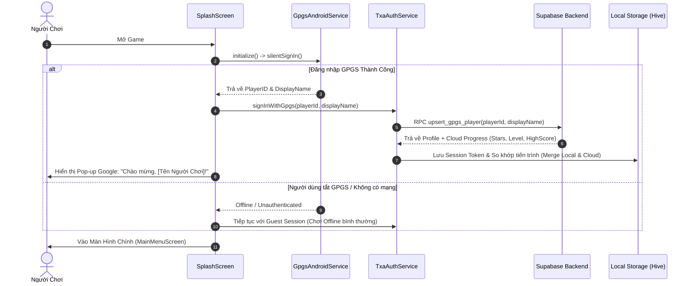

# 📋 Kế Hoạch Triển Khai: Đăng Nhập 1-Chạm Ngầm GPGS & Liên Kết TXA Cloud

> **Tài liệu đặc tả kiến trúc kỹ thuật:** Triển khai tính năng **Silent 1-Tap Sign-in** qua Google Play Games Services (GPGS) và tự động đồng bộ tài khoản với **TXA Studio Cloud / Supabase**.

---

## 🎯 1. Mục Tiêu Nghiệp Vụ (Business Objectives)

1. **Trải nghiệm người dùng liền mạch (Frictionless UX):**
   - Người chơi mở game là chơi ngay, không cần gõ Email, Mật khẩu hay qua các bước đăng ký tài khoản phức tạp.
   - Tự động nhận diện và đăng nhập ngầm trong lúc game tải tài nguyên ở màn hình `SplashScreen`.
2. **Định danh duy nhất & Chống gian lận (Unique Identity & Anti-Cheat):**
   - Tận dụng `Player ID` duy nhất do Google cấp để tạo hoặc ánh xạ trực tiếp vào tài khoản người chơi trong bảng `users` trên Supabase.
   - Chống việc một người dùng giả mạo điểm số trên bảng xếp hạng (Leaderboards).
3. **Chơi chéo & Lưu trữ đám mây (Cross-Play & Cloud Sync):**
   - Đồng bộ màn chơi, số sao, điểm số và các gói vật phẩm đã mua (IAP) giữa **Điện thoại Android** và **Google Play Games trên PC**.

---

## 🏗️ 2. Luồng Xử Lý Dữ Liệu (Data Flow)

---

## 🛠️ 3. Danh Sách Các Tệp Sẽ Chỉnh Sửa & Bổ Sung

### A. Tầng Dịch Vụ GPGS (`lib/services/gpgs/`)
1. **`gpgs_service.dart`**:
   - Thêm getter:
     - `String? get playerId;`
     - `String? get playerDisplayName;`
     - `String? get playerAvatarUrl;`
2. **`gpgs_android_impl.dart`**:
   - Trong hàm `silentSignIn()` và `explicitSignIn()`:
     - Gọi `await GamesServices.getPlayerID()` để lấy mã định danh duy nhất.
     - Gọi `await GamesServices.getPlayerName()` để lấy tên hiển thị của người chơi trên Google Play.
     - Lưu trạng thái vào `_cachedPlayerId` và `_cachedDisplayName`.

### B. Tầng Xác Thực & Cloud (`lib/services/auth/` & `lib/services/`)
1. **`txa_auth_service.dart`**:
   - Bổ sung phương thức `signInWithGpgs({required String playerId, required String displayName})`.
   - Lưu trữ `AuthType.gpgs` để đánh dấu tài khoản đã được bảo vệ bởi Google Play Games.
2. **`supabase_service.dart`**:
   - Thêm RPC / REST call: `sync_gpgs_account(playerId, displayName, localData)`.
   - So sánh phiên bản dữ liệu (`updated_at` hoặc tổng số sao `stars`): nếu dữ liệu trên Cloud cao hơn local, tự động cập nhật local.

### C. Giao Diện & Trải Nghiệm (`lib/presentation/`)
1. **`splash_screen.dart`**:
   - Tích hợp bước gọi `silentSignIn()` vào tiến trình khởi tạo song song với `TxaConfig.init()` và nạp âm thanh, không làm tăng thời gian chờ mở app.
2. **`profile_dialog.dart`**:
   - Hiển thị huy hiệu **Google Play Games** (icon tay cầm xanh lá) bên cạnh tên người chơi khi đã đăng nhập.
   - Thêm nút "Đổi tài khoản Google" hoặc "Đăng nhập Google Play Games" nếu người dùng đang chơi ở chế độ Khách (Guest).

---

## 🧪 4. Kịch Bản Kiểm Thử (Testing Matrix)

| STT | Kịch Bản Kiểm Thử | Kết Quả Kỳ Vọng |
| :--- | :--- | :--- |
| **TC-01** | Máy có sẵn tài khoản Google & Google Play Games mở app lần đầu | Tự động đăng nhập ngầm không cần bấm nút, hiện popup chào mừng của Google. |
| **TC-02** | Thiết bị đang ở chế độ Máy bay (Không có kết nối mạng) | Game không bị đơ/treo, âm thầm chuyển sang Guest Mode và chơi offline bình thường. |
| **TC-03** | Người chơi vượt màn khi offline, sau đó bật mạng lại | Hệ thống tự động đẩy điểm số và thành tích đang xếp hàng (`_offlineScoreQueue`) lên Google Play. |
| **TC-04** | Người chơi cài game trên PC (Google Play Games on PC) | Đăng nhập cùng tài khoản Google -> tự động kéo toàn bộ số sao và màn chơi từ điện thoại sang PC. |

---

## 📌 5. Trạng Thái Hiện Tại
* **Trạng thái:** 🟡 *Đã quy hoạch kiến trúc, sẵn sàng triển khai trong giai đoạn tới.*
* **Phụ thuộc:** Google Play Games Services trên Google Play Console đã xuất bản và kích hoạt thông tin xác thực Android.
